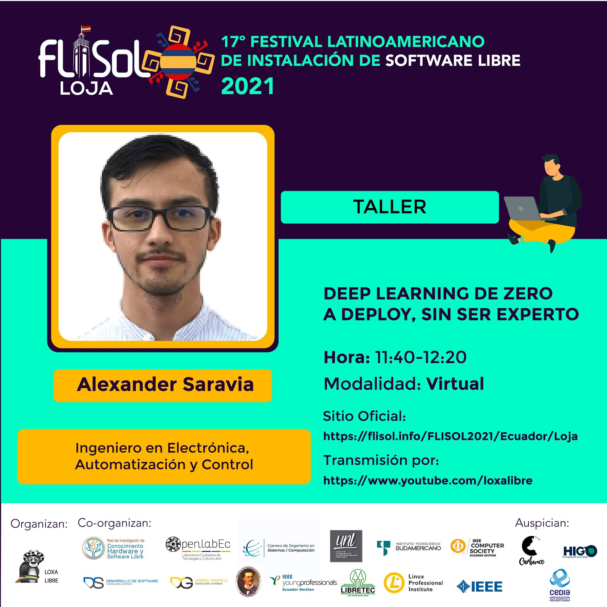

# Deep Learning:  Zero a Deploy

Vamos a emplear herramientas de alto nivel como Tachable Machine y Tensorflow Playground para podee introducirnos al mundo del Deep Learning.

Este es el código del Taller compartido para FLISOL Loja 2021.

 </img>

___

Dudas o sugerencias, contácteme:

 

> Desarrollo: Alexander Saravia

> email: asaravia@sunplenatech.com 

____

<a rel="license" href="http://creativecommons.org/licenses/by-nc-sa/4.0/">
 
 </a>  This work is licensed under a <a rel="license" href="http://creativecommons.org/licenses/by-nc-sa/4.0/">Creative Commons Attribution-NonCommercial-ShareAlike 4.0 International License</a>

